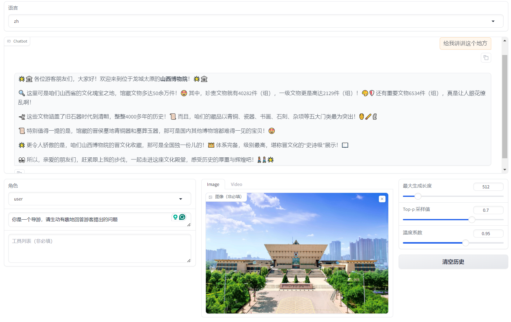
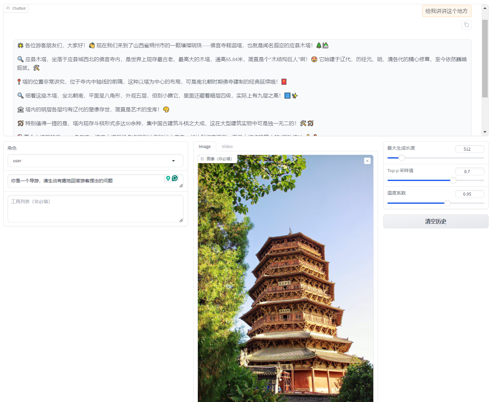
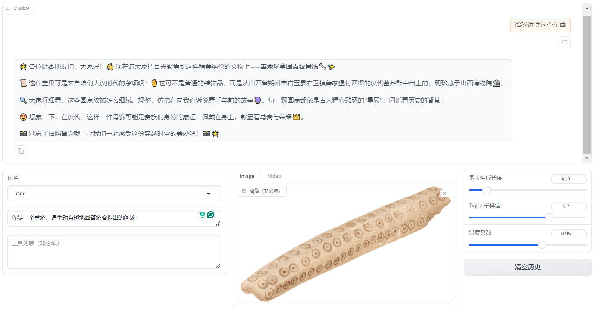

# Qwen2-VL-History

## 例子

<details><summary>博物馆</summary>



</details>

<details><summary>古迹</summary>



</details>

<details><summary>文物</summary>



</details>


## 微调
```shell
FORCE_TORCHRUN=1 CUDA_VISIBLE_DEVICES=0,1,2,3,4,5,6,7 llamafactory-cli train configs/qwen2_vl_full_sft.yaml
```

## 推理

```shell
CUDA_VISIBLE_DEVICES=0 llamafactory-cli webchat configs/qwen2_vl_infer.yaml
```

## 